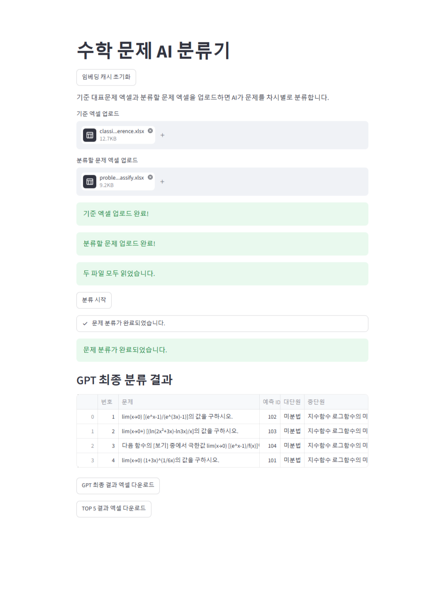

# 📚 AI Math Problem Classifier

> Embedding + Cosine Similarity + GPT를 활용한 고등학교 수학 문제 자동 분류 프로그램

---

## 📖 프로젝트 소개

새로운 수학 문제가 입력되면 교육과정의 차시를 자동으로 분류하는 AI 프로그램입니다.

이 프로젝트는 임베딩과 코사인 유사도를 이용해 가장 유사한 차시 후보를 먼저 추출한 뒤,
GPT가 최종적으로 가장 적절한 차시를 선택하는 2단계 분류 방식을 사용합니다.

---

## 🔄 분류 과정

```text
기준 대표 문제 엑셀 업로드
        ↓
기준 대표 문제 임베딩 생성
        ↓
분류할 문제 엑셀 업로드
        ↓
분류할 문제 임베딩 생성
        ↓
코사인 유사도 계산
        ↓
차시별 Top 5 후보 추출
        ↓
GPT 최종 판단
        ↓
최종 차시 선택
        ↓
결과 엑셀 다운로드
```

---

## 🚀 주요 기능

- 🧠 OpenAI Embedding API를 이용한 문제 임베딩 생성
- 📐 코사인 유사도 계산
- 🏆 차시별 Top 5 후보 추출
- 🤖 GPT를 이용한 최종 차시 선택
- 🌐 Streamlit 기반 웹 인터페이스
- 📥 결과 엑셀 다운로드
- ⚡ 대표 문제 임베딩 Disk Cache 지원
- 📊 진행률 표시
- ✅ 입력 파일 검증 및 오류 처리

---

## 🛠 기술 스택

- Python
- OpenAI API
- Streamlit
- Pandas
- Openpyxl
- python-dotenv

---

## 📁 프로젝트 구조

```text
math-problem-classifier/
├── images/
│   └── result_screen.png
├── app.py
├── classify_problem.py
├── classification_reference.xlsx
├── problems_to_classify.xlsx
├── requirements.txt
├── .env.example
├── .gitignore
└── README.md
```

---

## 🖥 실행 화면

기준 대표 문제와 분류할 문제를 업로드하면 분류 진행 상황과 GPT 최종 결과를 확인하고, 결과를 엑셀 파일로 다운로드할 수 있습니다.



---

## ▶ 실행 방법

### 1. 저장소 복제

```bash
git clone https://github.com/jj0-311/math-problem-classifier.git
```

### 2. 프로젝트 폴더로 이동

```bash
cd math-problem-classifier
```

### 3. 가상환경 생성

```bash
python -m venv venv
```

### 4. 가상환경 활성화

Windows PowerShell:

```powershell
venv\Scripts\Activate.ps1
```

Windows CMD:

```cmd
venv\Scripts\activate
```

### 5. 필요한 라이브러리 설치

```bash
pip install -r requirements.txt
```

### 6. 환경변수 설정

`.env.example` 파일을 복사하여 `.env` 파일을 만들고, 자신의 OpenAI API 키를 입력합니다.

```env
OPENAI_API_KEY=your_api_key_here
```

### 7. 프로그램 실행

```bash
python -m streamlit run app.py
```

실행 후 브라우저에서 아래 주소로 접속합니다.

```text
http://localhost:8501
```

---

## 🔎 문제 해결 과정

### 1. 모든 차시를 GPT에 직접 전달하는 방식의 한계

처음에는 분류할 문제와 모든 차시 정보를 GPT에 전달하는 방식을 고려했습니다.

하지만 후보가 많아질수록 입력 내용이 길어지고, GPT가 관련성이 낮은 차시까지 함께 비교해야 한다는 문제가 있었습니다.

이를 해결하기 위해 임베딩과 코사인 유사도를 이용해 관련성이 높은 차시 후보 5개를 먼저 추출하고, GPT는 해당 후보만 비교하도록 구조를 변경했습니다.

### 2. 같은 차시가 후보에 반복되는 문제

기준 문제별 유사도만 기준으로 정렬하면 동일한 차시에 속한 대표 문제가 Top 5 안에 여러 번 포함될 수 있었습니다.

이를 해결하기 위해 차시 ID를 기준으로 중복을 제거한 뒤 상위 5개 차시만 남기도록 수정했습니다.

### 3. 다운로드 후 결과가 사라지는 문제

Streamlit은 버튼을 누를 때마다 코드가 다시 실행되기 때문에, 다운로드 버튼을 누르면 기존 분류 결과가 사라지는 문제가 있었습니다.

분류 결과를 `st.session_state`에 저장하여 화면이 다시 실행되어도 결과가 유지되도록 개선했습니다.

### 4. 반복 임베딩으로 인한 시간과 비용 문제

기준 대표 문제는 자주 변경되지 않지만, 프로그램을 실행할 때마다 동일한 문제를 다시 임베딩하고 있었습니다.

대표 문제 문장 목록과 임베딩 모델명을 기준으로 디스크 캐시를 적용하여, 동일한 기준 데이터는 OpenAI API를 다시 호출하지 않고 기존 임베딩을 재사용하도록 개선했습니다.

---

## 🛠 개선 사항

- 콘솔 실행 방식에서 Streamlit 웹 인터페이스로 확장
- 중간 임베딩 엑셀 파일 저장 과정 제거
- 분류 로직과 웹 화면 코드를 별도 파일로 분리
- 차시 ID 기준 중복 제거를 적용해 Top 5 후보 품질 개선
- GPT가 후보 외 ID를 반환하는 경우 검증 로직 추가
- 진행률 바와 작업 상태 문구 추가
- 필수 열, 빈 셀, 잘못된 GPT 응답에 대한 오류 처리 추가
- `st.session_state`를 이용해 다운로드 후에도 결과 유지
- 대표 문제 임베딩에 디스크 캐시를 적용해 반복 API 호출 감소
- `.env`를 이용해 API 키를 소스코드와 분리